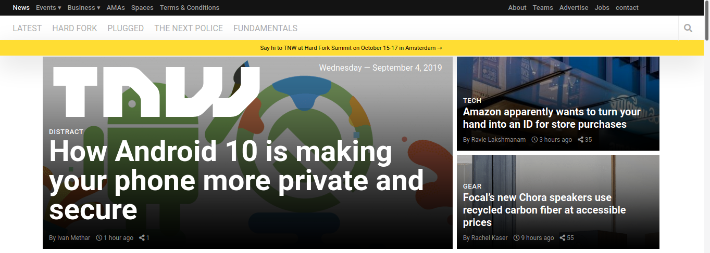

# PROJECT: BUILDING WITH RESPONSIVE DESIGN

This is the sixth project of the Main HTML/CSS curriculum at [Microverse](https://www.microverse.org/) - @microverseinc

* The objective is to create a responsive [website](http://thenextweb.com/) using media queries.
* The project was completed using html and css 

#### [Assignment link]( https://www.theodinproject.com/courses/html5-and-css3/lessons/building-with-responsive-design)

#### [Preview]( https://raw.githack.com/damiecode/The-Next-Web/Next-Web/index.html)

#### [Live link]( https://damiecode.github.io/The-Next-Web/)

## Authors

👤 **Carlito**

- Github: [@Sick-Carlito](https://github.com/Sick-Carlito)

👤 **Damilola Ale**

- Github: [@damiecode](https://github.com/damiecode)

## Show your support

Give a ⭐️ if you like this project!

I am looking for my next opportunity, contact me on _codenlyn@gmail.com_.

